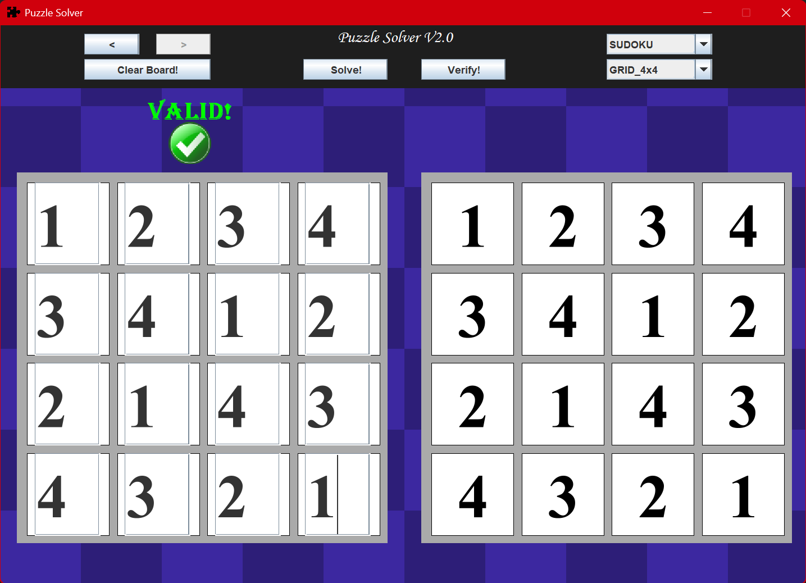
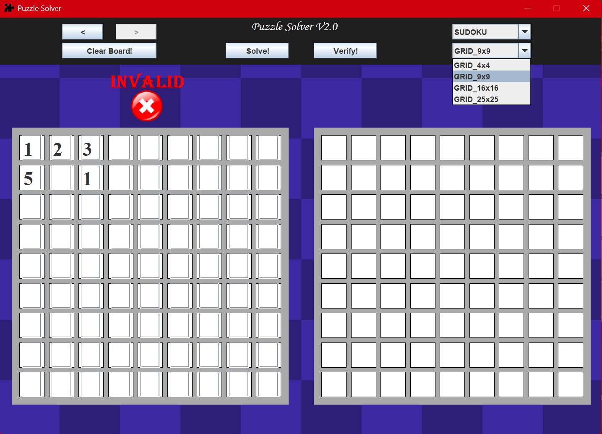
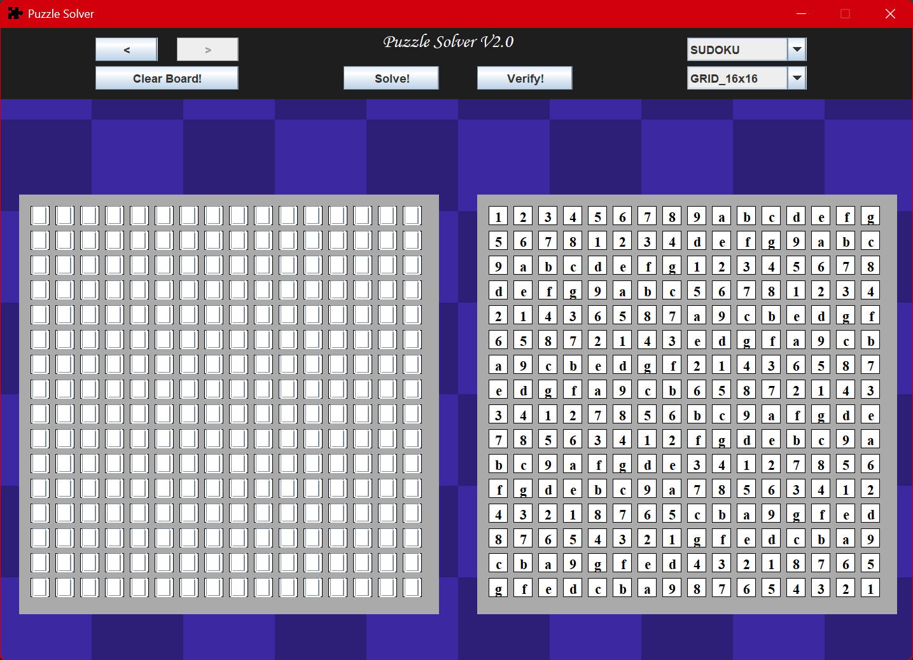

# Repo - PuzzleSolver

## Author - DMark

### Email - markjdevin@gmail.com

This project is a simple puzzle solving application. Currently, the only implemented puzzle to solve is a Sudoku puzzle, but it has been abstracted to support various types of puzzle like Flow puzzles.

The GUI library used in this application is Swing and basic OOP principles have been utilized for creating the various classes. Because of the nature of Swing, the head of the project is the SolverFrame, and all additional elements are placed inside of this. This project should be executed from the main file and the solver window will appear. 

Until a faster algorithm has been implemented, the Sudoku Puzzle solver should only be used up to 9x9, as anything higher can (and most likely will) become stalled for extreme periods of time (years?). As such, these should not be used, but serve as placeholders for when a faster algorithm is implemented.

Additionally, because of the simplicity of this program, it has been decided to lock the GUI at 970 x 700 pixels. This is a reasonable size that fits on most modern displays, and makes the program sizing logic much simpler.

### Example Program Usage Screenshots

